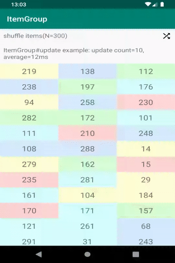
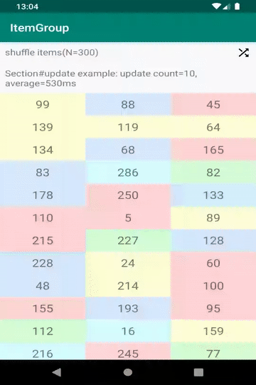

[  ](https://bintray.com/scache/maven/item-group/1.1.1/link)

```
implementation("com.github.sckm:item-group:1.1.1") {
   exclude group: 'com.xwray', module: 'groupie'
   exclude group: 'androidx.recyclerview', module: 'recyclerview'
}
```

# ItemGroup
`ItemGroup` is `Group` for [Groupie](https://github.com/lisawray/groupie)

`ItemGroup` is like `Section` and optimize performance for `Group` that contains only `Item`.  
Some methods(getItem, update,...) cost is lower than `Section`'s one.

## Benchmark
Below are benchmark result for reference:(Tests are run on Pixel 3 XL)  
[Benchmark tests code](https://github.com/sckm/ItemGroup/blob/master/benchmark/src/androidTest/java/com/github/sckm/itemgroup/benchmark/ItemGroupBenchmark.kt)

### update with 100 shuffled items
class | time(micro sec)
:--:|:--:
ItemGroup | 1,039
Section | 36,401

### update with same 100 items
class | time(micro sec)
:--:|:--:
ItemGroup | 31
Section | 722

## Compatibility with Groupie
ItemGroup version | Groupie version
:--:|:--:
1.1.0 ~ 1.1.1 | 2.2.0 ~ 2.5.1
TODO | 2.6.0 ~


## Example
ItemGroup | Section
:--:|:--:
|


## License
```
Copyright 2019 scache

Licensed under the Apache License, Version 2.0 (the "License");
you may not use this file except in compliance with the License.
You may obtain a copy of the License at

   http://www.apache.org/licenses/LICENSE-2.0

Unless required by applicable law or agreed to in writing, software
distributed under the License is distributed on an "AS IS" BASIS,
WITHOUT WARRANTIES OR CONDITIONS OF ANY KIND, either express or implied.
See the License for the specific language governing permissions and
limitations under the License.
```
